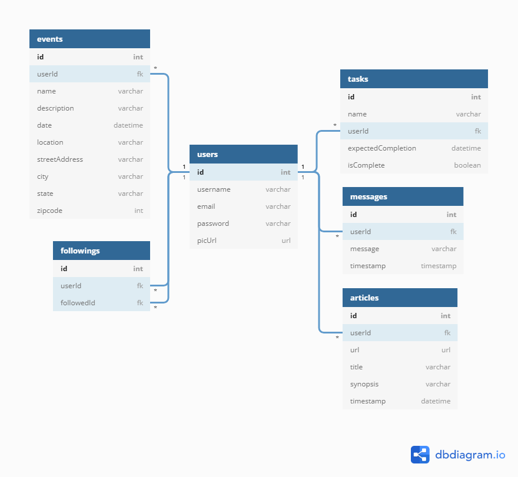

# React Nutshell

## Setup:

This project was bootstrapped with [Create React App](https://github.com/facebook/create-react-app).

Steps to get started:
1. Clone this repo
1. `cd` into the directory it creates
1. `npm start` to run the app in the development mode
1. `json-server -p 8200 -w api/database.json`
1. Open [http://localhost:3000](http://localhost:3000) to view it in the browser.

The page will reload if you make edits. 
You will also see any lint errors in the console.

## Database Diagram 
